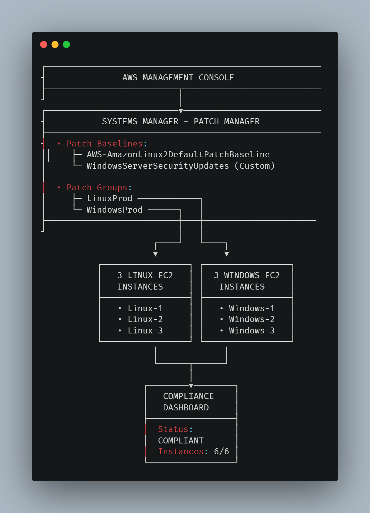
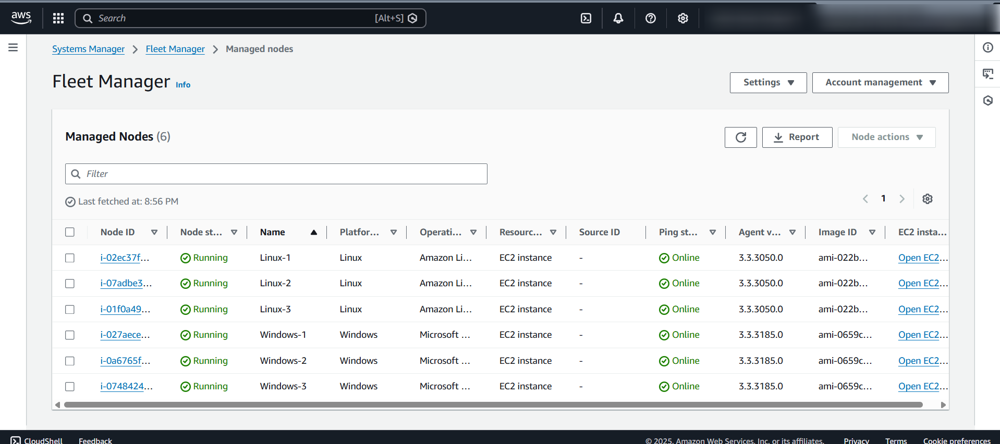
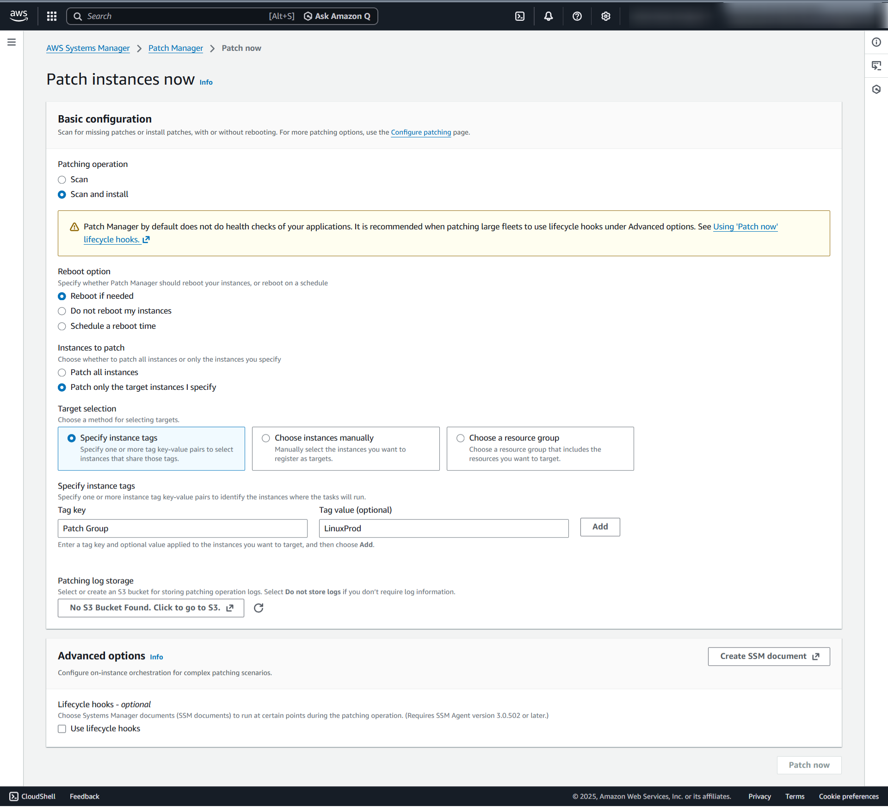
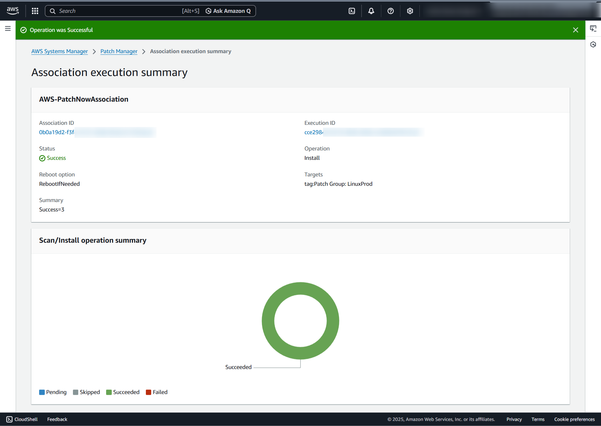
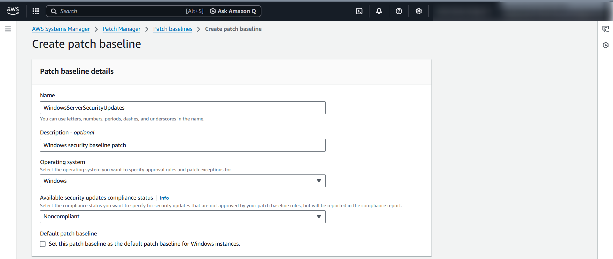
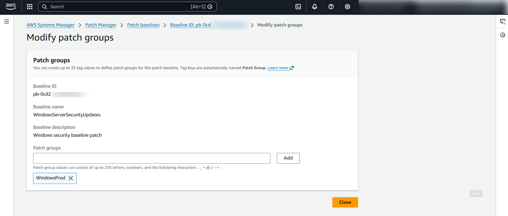
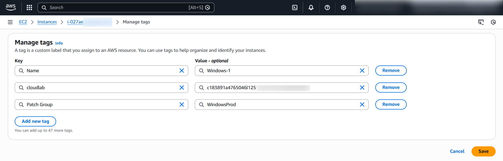
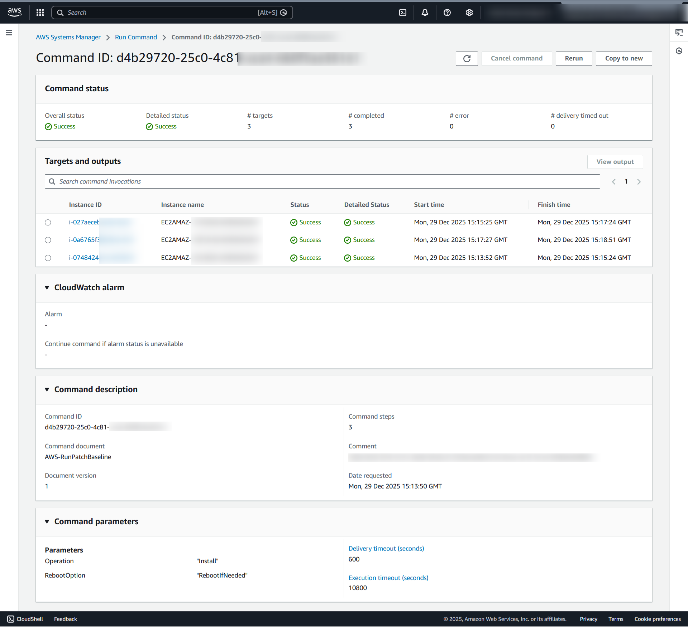
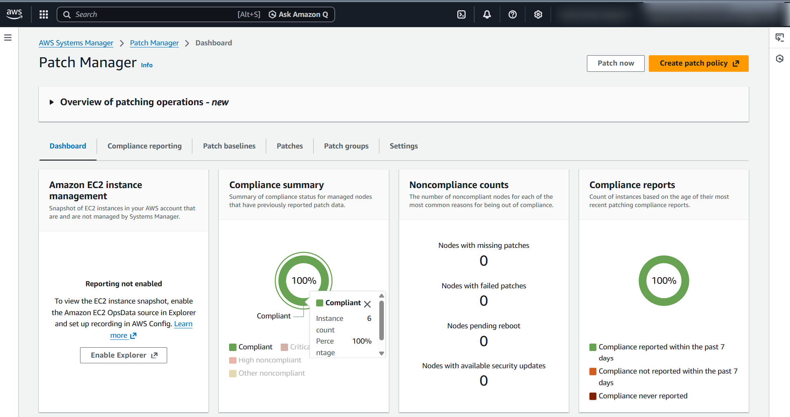
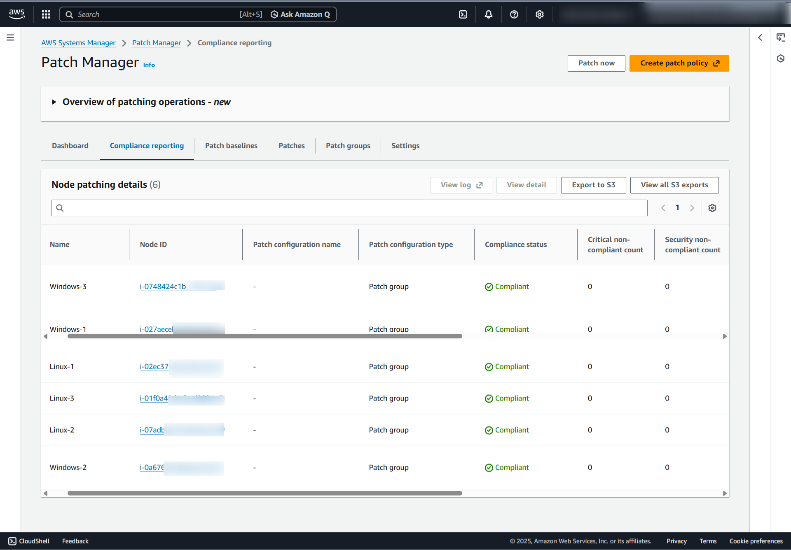

# 🔐 AWS EC2 Patch Management System

## Overview
Enterprise-grade automated patch management implementation using AWS Systems Manager to maintain OS security compliance across hybrid environments. This lab demonstrates centralized patch orchestration for mixed Linux and Windows EC2 instances following security best practices.

## 🎯 Objectives
- Automate patching for mixed OS environments (Linux & Windows)
- Create custom security patch baselines
- Implement patch grouping for targeted deployments
- Establish compliance monitoring and reporting
- Achieve 100% patch compliance across all instances

## 🏗️ Architecture

*Centralized patch orchestration using AWS Systems Manager Patch Manager*

## 🔧 Technologies & Services
- **AWS Systems Manager Patch Manager**
- **AWS EC2** (Linux & Windows instances)
- **AWS IAM Roles & Policies**
- **EC2 Tags & Patch Groups**
- **AWS Run Command**
- **AWS CloudTrail** (for audit logging)

## 📊 Key Metrics
- **Patch Compliance:** 100% (6/6 instances)
- **Deployment Time:** < 60 minutes for full fleet
- **Automation Level:** Fully automated scan and install
- **Security Coverage:** Critical & Important security patches

## 🚀 Implementation Journey

### Phase 1: Environment Discovery

*Initial assessment showing 6 EC2 instances (3 Linux, 3 Windows) managed by Systems Manager, ready for patch compliance operations.*

### Phase 2: Linux Patching Configuration  

*Configuring automated scan and install for Linux instances using tag-based targeting (Patch Group: LinuxProd) with AWS default Amazon Linux 2 baseline.*

### Phase 3: Linux Patch Execution

*Real-time patch deployment status showing 3 affected instances with progress tracking through AWS-PatchNowAssociation.*

### Phase 4: Custom Baseline Creation

*Creating custom security patch baseline "WindowsServerSecurityUpdates" with rules for Critical and Important severity security updates only.*

### Phase 5: Patch Group Assignment

*Associating custom baseline with WindowsProd patch group for targeted deployment to specific instances.*

### Phase 6: Windows Instance Tagging

*Tagging Windows instances with Patch Group: WindowsProd for baseline association and targeted patching operations.*

### Phase 7: Windows Patching Setup

*Configuring Windows patch deployment using custom baseline with reboot policy and tag-based instance selection.*

### Phase 8: Patch Operation Details

*Systems Manager Run Command output showing patch deployment details including baseline ID and patch group verification.*

### Phase 9: Compliance Dashboard

*Patch Manager dashboard confirming 100% compliance across all 6 instances after successful patch deployments.*

### Phase 10: Detailed Compliance View

*Instance-level compliance details showing critical/security patch counts, last operation timestamps, and baseline associations.*

## 🔐 Security Best Practices Implemented
- ✅ **Automated Patch Deployment:** Reduced manual intervention and human error
- ✅ **Custom Security Baselines:** Security-specific update approvals only
- ✅ **Patch Grouping Strategy:** Environment-based deployment control
- ✅ **Compliance Monitoring:** Real-time dashboard for patch status
- ✅ **Least Privilege IAM:** Minimal permissions for patch operations
- ✅ **Tag-Based Management:** Consistent resource organization

## 🛠️ Technical Implementation

### Linux Patching Command
```bash
aws ssm create-association \
  --name "AWS-RunPatchBaseline" \
  --parameters '{"Operation":["ScanAndInstall"]}' \
  --targets 'Key="tag:PatchGroup",Values=["LinuxProd"]'
